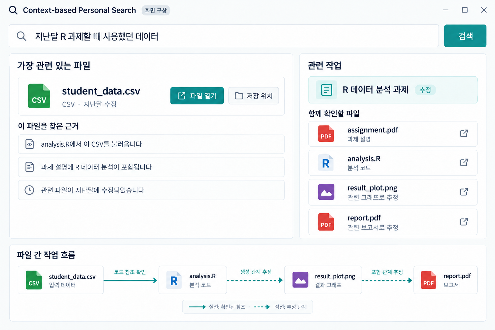

# Context-based Personal Search

**파일 이름을 몰라도, 사용했던 상황으로 다시 찾는 AI 기반 개인 파일 검색**

## **프로젝트 개요**

PC에 자료가 쌓이면 파일명과 저장 위치를 기억하기 어려워집니다. 반면 “지난달 R 과제할 때 사용했던 데이터”처럼 **파일을 사용했던 상황**은 기억하는 경우가 많습니다. 컴퓨터는 파일을 개별 항목으로 저장하지만, 사용자는 작업과 경험을 중심으로 기억하기 때문입니다.

이 프로젝트는 파일의 내용·시간·형식·관계를 분석해 **원하는 파일을 찾고, 같은 작업에 사용된 관련 파일까지 연결하는 검색 시스템**을 목표로 합니다.

## **검색 흐름**

**상황 입력 → 내용·시간·관계 분석 → 작업 맥락 추론 → 파일과 관련 자료 제시**

| 단계 | 활용할 정보와 역할 |
| --- | --- |
| 상황 입력 | “지난달”, “R 과제”, “데이터”에서 시기·작업·파일 역할 파악 |
| 단서 분석 | 파일 내용과 의미적 유사성, 생성·수정 시점, 형식, 파일 간 참조 확인 |
| 맥락 추론 | 같은 작업에 속할 가능성과 데이터·코드·결과물의 연결 관계 추론 |
| 결과 제시 | 대상 파일, 추천 근거, 관련 작업과 파일 간 관계 표시 |

## **검색 예시**

> “지난달 R 과제할 때 사용했던 데이터”

- **찾는 파일:** `student_data.csv`와 검색 근거를 확인하고 파일을 엽니다.
- **관련 작업:** R 데이터 분석 과제에 연결된 설명 PDF, 코드, 그래프, 보고서를 확인합니다.
- **파일 간 흐름:** `데이터 → 분석 코드 → 그래프 → 보고서`의 관계를 살펴봅니다. 확인된 참조는 실선, 추정 관계는 점선으로 구분합니다.

위 화면은 목표 검색 경험을 보여주는 시안입니다. 파일과 근거는 예시이며, 실제 UI는 이후 설계 단계에서 구체화합니다.

## **핵심 아이디어와 차별점**

여기서 **맥락(Context)**은 파일이 사용된 작업의 목적, 시기, 함께 사용한 자료와 결과물의 관계를 뜻합니다.

| 검색 접근 | 핵심 질문 |
| --- | --- |
| 파일명·키워드 검색 | 검색어가 이름이나 본문에 있는가? |
| 내용 기반 의미 검색 | 검색어와 내용이 의미적으로 관련 있는가? |
| **맥락 기반 검색** | **사용자가 기억하는 작업에서 사용된 파일인가?** |

- **파일 재발견:** 검색어가 파일에 없어도 관련 코드·문서·시간 정보를 통해 찾습니다.
- **작업 관계 복원:** 데이터, 코드, 참고 자료, 결과물을 하나의 작업 맥락으로 연결합니다.
- **근거 기반 연결:** 내용이나 시점이 비슷하다는 이유만으로 같은 작업이라고 단정하지 않고, 확인된 사실과 추정을 구분합니다.

예를 들어 CSV에 “R 과제”라는 문구가 없어도, 이를 읽는 R 코드와 과제 설명이 연결되면 찾을 수 있어야 합니다. 반대로 R을 다루는 문서라도 해당 과제와 무관하면 같은 작업으로 묶지 않아야 합니다. 생성·수정 시점은 실제 사용 시점과 다를 수 있어 다른 단서와 함께 해석합니다.

파일을 새 폴더로 정리하거나 문서를 요약하는 것보다, **사용자의 기억에 가까운 검색 경험**을 만드는 데 초점을 둡니다.

## **데이터셋 구성 계획**

| 구분 | 구성 | 목적 |
| --- | --- | --- |
| 공개 데이터 | arXiv, 20 Newsgroups 등 검토 | 기본적인 의미 분석·유사도 검색 검증 |
| 자체 데이터 | PDF, CSV, PPTX, 코드, 이미지 등 총 200~500개 파일 고려 | 작업 맥락 검색·파일 관계 복원 검증 |

자체 데이터는 **작업별 파일 세트**로 구성합니다.

- **R 분석 과제:** 과제 PDF → CSV + R 코드 → 그래프 + 보고서
- **발표 준비:** 참고 논문 + 메모 + 이미지 → 발표 PPTX
- **Python 실습:** 실습 안내 + 원본 CSV + 코드 → 처리 결과 CSV

주제가 비슷한 다른 작업, 같은 시기에 진행된 작업, 재사용 자료, 수정본, 무관한 파일도 포함할 계획입니다. 필요하면 생성형 AI로 작업 세트를 만들고 파일 간 내용과 참조 관계를 확인합니다.

평가를 위해 **검색 질문, 정답 파일, 소속 작업, 관련 파일과 관계**를 별도로 기록합니다. 이 정답 정보는 검색 입력과 분리해 관리합니다.

공개 데이터는 의미 검색의 기초 검증에 사용하고, 자체 데이터로 작업 맥락 복원을 검증합니다. 인위적으로 설정한 시간 정보는 별도로 기록하며, 평가 데이터 분리는 작업 단위로 검토합니다.

## **검증 방향**

파일명·키워드 검색, 의미 검색, 맥락 기반 검색을 같은 데이터와 질문으로 비교합니다.

- 원하는 파일이 상위 결과에 나타나는가?
- 같은 작업의 관련 파일을 찾고 무관한 파일은 제외하는가?
- 주제나 시기가 비슷한 서로 다른 작업을 구분하는가?
- 파일 간 관계와 추천 근거가 실제 내용으로 뒷받침되는가?

## **서비스 형태**

**Python 기반 데스크톱 애플리케이션**을 고려하며, GUI에는 **PySide6**를 사용할 예정입니다. 자연어 검색 후 대상 파일, 추정된 작업 맥락, 관련 파일을 함께 확인하는 흐름을 목표로 합니다.

## **앞으로의 진행 절차**

1. **문제 구체화:** 검색 시나리오, 지원 범위, 평가 기준 정의
2. **데이터 구성:** 작업별 파일 세트와 검색 질문·정답 작성
3. **기준 성능 측정:** 파일명·키워드 검색 및 의미 검색 평가
4. **맥락 검색 실험:** 내용·시간·파일 관계를 활용한 검색 비교
5. **오류 분석·개선:** 놓친 파일과 잘못 연결된 관계 분석
6. **데모 구현·최종 검증:** 데스크톱 검색 흐름 구현 및 결과 정리

위 내용은 개발·검증 계획이며, 구체적인 검색 방식과 시스템 구조는 이후 설계 단계에서 결정합니다.
